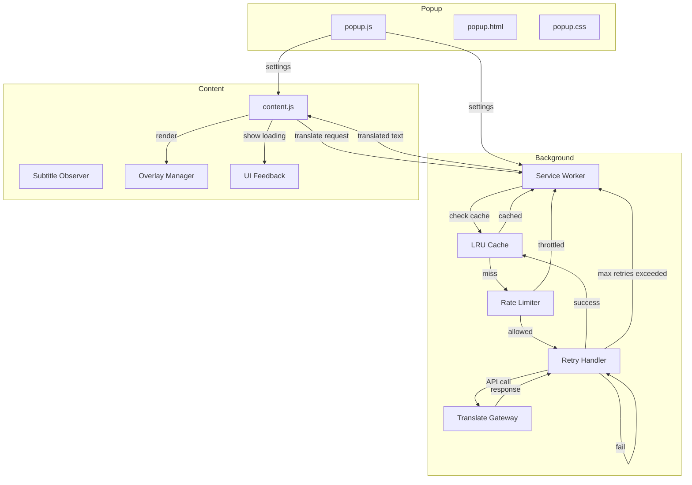

# Kế Hoạch Cải Tiến YouTube Bilingual Subtitles

## Tổng Quan Cải Tiến

Kế hoạch này addresses 7 vấn đề chính được phát hiện trong quá trình kiểm tra codebase, với các giải pháp cụ thể và có thể thực hiện được.

---

## Sơ Đồ Kiến Trúc Mới



---

## Chi Tiết Từng Cải Tiến

### 1. Cải Thiện Error Handling và Retry Mechanism

#### Vấn Đề Hiện Tại
- Không có retry khi translation thất bại
- User không được thông báo về lỗi

#### Giải Pháp

**File**: [`background/background.js`](background/background.js:1)

```javascript
// Cấu hình retry
const RETRY_CONFIG = {
  maxRetries: 3,
  baseDelay: 1000,  // ms
  maxDelay: 5000,
  exponentialBase: 2
};

async function translateWithRetry(text, targetLang, retryCount = 0) {
  try {
    return await translateText(text, targetLang);
  } catch (error) {
    if (retryCount < RETRY_CONFIG.maxRetries) {
      const delay = Math.min(
        RETRY_CONFIG.baseDelay * Math.pow(RETRY_CONFIG.exponentialBase, retryCount),
        RETRY_CONFIG.maxDelay
      );
      console.warn(`Retry ${retryCount + 1}/${RETRY_CONFIG.maxRetries} after ${delay}ms`);
      await new Promise(resolve => setTimeout(resolve, delay));
      return translateWithRetry(text, targetLang, retryCount + 1);
    }
    throw new Error(`Translation failed after ${RETRY_CONFIG.maxRetries} retries: ${error.message}`);
  }
}
```

---

### 2. Implement LRU Cache Giới Hạn

#### Vấn Đề Hiện Tại
- `Map` không giới hạn gây rò rỉ memory

#### Giải Pháp

**File**: [`background/background.js`](background/background.js:1)

```javascript
class LRUCache {
  constructor(maxSize = 1000) {
    this.maxSize = maxSize;
    this.cache = new Map();
  }

  get(key) {
    if (!this.cache.has(key)) return null;
    // Move to end (most recently used)
    const value = this.cache.get(key);
    this.cache.delete(key);
    this.cache.set(key, value);
    return value;
  }

  set(key, value) {
    if (this.cache.has(key)) {
      this.cache.delete(key);
    } else if (this.cache.size >= this.maxSize) {
      // Remove oldest entry
      this.cache.delete(this.cache.keys().next().value);
    }
    this.cache.set(key, value);
  }

  get size() {
    return this.cache.size;
  }
}

const translationCache = new LRUCache(1000);
```

---

### 3. Thêm Loading State và Feedback

#### Vấn Đề Hiện Tại
- Không có indicator khi đang dịch
- User không biết extension đang hoạt động

#### Giải Pháp

**File**: [`content/content.js`](content/content.js:1)

```javascript
// Thêm biến state
let isLoading = false;
let loadingTimeout = null;

function renderOverlay(translatedText) {
  isLoading = false;
  clearTimeout(loadingTimeout);
  
  const overlay = getOrCreateOverlay();
  overlay.classList.remove('loading');
  
  // ... rest of existing code
}

function showLoadingState() {
  if (isLoading) return;
  isLoading = true;
  
  const overlay = getOrCreateOverlay();
  overlay.classList.add('loading');
  overlay.textContent = 'Đang dịch...';
  overlay.style.display = 'block';
  
  // Timeout sau 5 giây nếu không có response
  loadingTimeout = setTimeout(() => {
    if (isLoading) {
      overlay.textContent = 'Hết giờ!';
      isLoading = false;
    }
  }, 5000);
}
```

**File**: [`content/overlay.css`](content/overlay.css:1)

```css
#yt-bilingual-sub.loading {
  opacity: 0.7;
  animation: pulse 1.5s infinite;
}

@keyframes pulse {
  0% { opacity: 0.5; }
  50% { opacity: 0.9; }
  100% { opacity: 0.5; }
}
```

---

### 4. Mở Rộng URL Match

#### Vấn Đề Hiện Tại
- Chỉ match `https://*.youtube.com/watch*`
- Không hoạt động cho Shorts, embedded, hoặc explore pages

#### Giải Pháp

**File**: [`manifest.json`](manifest.json:1)

```json
"content_scripts": [
  {
    "matches": [
      "https://*.youtube.com/watch*",
      "https://*.youtube.com/shorts*",
      "https://*.youtube.com/embed/*",
      "https://www.youtube.com/*"
    ],
    "js": ["content/content.js"],
    "css": ["content/overlay.css"]
  }
]
```

**File**: [`content/content.js`](content/content.js:1) - Thêm logic phát hiện video context

```javascript
function isYouTubeVideoPage() {
  return location.href.includes('youtube.com') && 
         (location.href.includes('v=') || 
          location.href.includes('/shorts/') ||
          document.querySelector('.html5-video-player'));
}
```

---

### 5. Implement Rate Limiting

#### Vấn Đề Hiện Tại
- Có thể gây nhiều request đồng thời
- Không có cơ chế throttle

#### Giải Pháp

**File**: [`background/background.js`](background/background.js:1)

```javascript
class RateLimiter {
  constructor(maxRequests = 10, windowMs = 1000) {
    this.maxRequests = maxRequests;
    this.windowMs = windowMs;
    this.requests = [];
  }

  isAllowed() {
    const now = Date.now();
    // Remove requests outside the window
    this.requests = this.requests.filter(t => now - t < this.windowMs);
    
    if (this.requests.length < this.maxRequests) {
      this.requests.push(now);
      return true;
    }
    return false;
  }

  getWaitTime() {
    const now = Date.now();
    this.requests = this.requests.filter(t => now - t < this.windowMs);
    if (this.requests.length === 0) return 0;
    return this.windowMs - (now - this.requests[0]) + 100;
  }
}

const rateLimiter = new RateLimiter(10, 1000); // 10 requests per second
```

---

### 6. Thêm Logging/Debugging Mode

#### Vấn Đề Hiện Tại
- Không có cơ chế logging
- Khó debug khi có sự cố

#### Giải Pháp

**File**: [`content/content.js`](content/content.js:1)

```javascript
// Thêm debug mode
let debugMode = false;

chrome.storage.sync.get(['debugMode'], (data) => {
  if (data.debugMode) debugMode = data.debugMode;
});

function logDebug(...args) {
  if (debugMode) {
    console.log('[YouTube Bilingual Subtitles]', ...args);
  }
}

// Sử dụng logDebug thay cho console.log ở các vị trí phù hợp
```

**File**: [`popup/popup.html`](popup/popup.html:1) - Thêm checkbox debug

```html
<div class="setting-item">
  <label for="debugMode">Debug Mode</label>
  <label class="switch">
    <input type="checkbox" id="debugMode">
    <span class="slider round"></span>
  </label>
</div>
```

---

### 7. Graceful Degradation

#### Vấn Đề Hiện Tại
- Khi API thất bại, không có fallback
- Extension ngừng hoạt động

#### Giải Pháp

**File**: [`background/background.js`](background/background.js:1)

```javascript
async function translateWithFallback(text, targetLang) {
  try {
    return await translateWithRetry(text, targetLang);
  } catch (error) {
    console.error('Translation failed, using fallback:', error);
    // Fallback: return original text với indicator
    return `[${targetLang}] ${text}`;
  }
}
```

**File**: [`content/content.js`](content/content.js:1) - Hiển thị lỗi cho user

```javascript
function renderError(message) {
  const overlay = getOrCreateOverlay();
  overlay.textContent = message;
  overlay.style.color = '#FF5252';
  overlay.style.display = 'block';
  isLoading = false;
}
```

---

## Thứ Tự Thực Hiện

| Bước | Task | File Chính | Độ Phức Tạp |
|------|------|------------|-------------|
| 1 | LRU Cache | background.js | Thấp |
| 2 | Rate Limiting | background.js | Thấp |
| 3 | Retry Mechanism | background.js | Trung Bình |
| 4 | Graceful Degradation | background.js, content.js | Trung Bình |
| 5 | Loading State | content.js, overlay.css | Thấp |
| 6 | URL Match Expansion | manifest.json | Thấp |
| 7 | Debug Mode | content.js, popup.html, popup.js | Trung Bình |

---

## Timeline Ước Lượng

| Phase | Tasks | Thời Gian |
|-------|-------|-----------|
| Phase 1 | LRU Cache, Rate Limiting | 30 phút |
| Phase 2 | Retry, Fallback | 45 phút |
| Phase 3 | Loading State, UI Feedback | 30 phút |
| Phase 4 | URL Match, Debug Mode | 30 phút |
| **Tổng** | | **~2 giờ** |

---

## Risk Assessment

| Risk | Mức Độ | Mitigation |
|------|--------|------------|
| YouTube thay đổi DOM | Trung Bình | Sử dụng multiple selectors fallback |
| Google Translate API thay đổi | Thấp | Fallback mechanism |
| Performance impact | Thấp | LRU cache giới hạn |
| Browser compatibility | Thấp | Manifest V3 đã được hỗ trợ rộng rãi |
